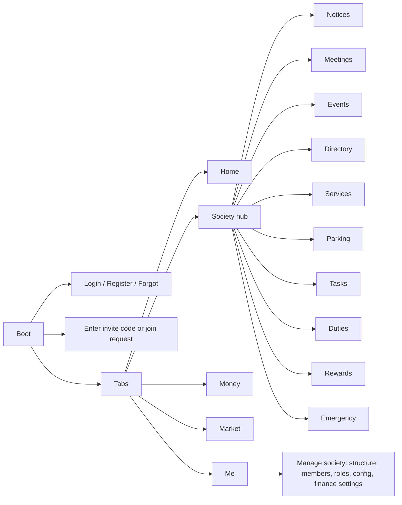

# Product and UX

## 1. Vision in one line

"My society, in one calm app." Residents see what matters today. Admins manage with less coordination.

## 2. UX principles (how we decide)

1. Home shows only what needs the user today. Maximum three attention items.
2. Every module is one tap away in the Society hub. Not on Home.
3. Users see only enabled modules and only actions their role allows.
4. Plain words. Residents see "Due", "Paid", "Your turn". Not "ledger" or "invoice".
5. One primary action per screen. It sits at the bottom, full width.
6. Forms ask the minimum. Defaults come from society configuration.
7. Every empty list explains what will appear there and who can add it.
8. Same layout in English, Hindi, Marathi. Text may grow 30%. No fixed-width labels.
9. Touch targets are 48dp. Body text is 15sp minimum.
10. Nothing destructive without a confirm sheet. Money and role changes are audited.

## 3. Who uses it

| Persona | Device | Wants | Watch out |
| --- | --- | --- | --- |
| Resident (owner, tenant, family) | mid-range Android | dues, notices, my duty, help fast | little patience for setup or settings |
| Committee member | same phone | publish notices, meetings, tasks; fewer WhatsApp threads | needs "publish" to be 3 taps |
| Treasurer | phone, sometimes laptop | record payments and expenses quickly; a history people trust | bulk work is hard on a phone (web admin LATER) |
| Admin (chairman, secretary) | phone | set up flats, members, roles, config once | must not be exposed to residents |
| Staff (security, maintenance) | basic Android | contacts, parking, raise an alert | optional in MVP; membership without a flat |
| Platform admin (us) | laptop | create societies, first admin | never visible in resident UI |

## 4. Information architecture

Bottom tab bar (floating pill, like the reference screens):

| Tab | Purpose | Shown when |
| --- | --- | --- |
| Home | Today's summary | always |
| Society | Hub grid of enabled modules | always |
| Money | My dues, history, receipts. Treasurer tools if permitted | maintenance module enabled (always in MVP) |
| Market | Community marketplace and buy-and-sell | marketplace module enabled |
| Me | Profile, my societies and flats, language, notifications, privacy, help, delete account | always |

So a society without marketplace has four tabs. Tabs are driven by server config, not code.

**Society hub** tiles (only enabled modules, in this order): Notices, Meetings, Events, Directory, Services, Parking, Tasks, Duties, Rewards, Emergency. Admins see a "Manage society" row at the bottom.

**Naming in the UI**: "Duties" for recurring responsibilities. "Services" for the vendor directory. "Dues" for maintenance. All labels are translation keys.

**Admin console** is not a separate app in MVP. It is `Me → Manage society` (a stack of management screens) plus contextual "+" and "Manage" buttons inside each module for permitted users.

**Global elements**
- Society switcher: tap the society chip in the Home header. A bottom sheet lists memberships (society plus flats). Active society persists on the device.
- Notification center: bell icon, unread dot, list grouped by day.
- Emergency: tile in the hub plus a quick action on Home. Hold to confirm. Never a single tap.

## 5. Home screen

Order from top to bottom:

1. **Header**: avatar, greeting with first name, society and flat chip (tap to switch), bell with unread dot.
2. **Today card** (soft brand tint). Headline "All clear today" or "2 things need you". Under it, up to three attention rows:
   - active emergency alert (danger style, always first)
   - dues due or overdue, with amount and date
   - my active duty, with "Mark done" when confirmation is allowed
   - task assigned to me or waiting for my verification
   - admin items: join requests, expenses to approve
   - overflow shows "+2 more" and opens the full attention list
3. **Quick actions** (four icon chips): Services, Directory, Emergency, Market. Admins without marketplace see Manage instead of Market.
4. **Upcoming**: the next meeting or event within 14 days. One or two compact cards.
5. **Notices**: pinned first, then the latest three. "See all".
6. **My contribution** (only if rewards enabled and the member has points or open tasks): "12 points this year".

Rules
- The server builds the summary (`GET /v1/societies/:id/home`). The app only renders it. The "what matters" logic is testable and can change without an app update.
- Attention items are a typed union. An older app ignores unknown item types.
- First day and empty states: Today card says "All clear today". Notices say "Notices from your committee will appear here".

## 6. Screen inventory (MVP)

| Module | Resident screens | Admin or role screens |
| --- | --- | --- |
| Auth | Login, Register, Forgot password, Reset with code | — |
| Onboarding | Enter invite code, Join request (pick wing and flat), Waiting for approval, Confirm profile | Invite member, Approve join request |
| Home | Home, Attention list, Notification center | — |
| Notices | List (pinned, filters), Detail | Create or edit, audience picker |
| Meetings | List (upcoming, past), Detail | Create, edit, cancel, mark completed |
| Events | List, Detail, RSVP | Create, edit, cancel |
| Directory | Members list (search, wing filter), Member profile (respects privacy) | Edit member, roles, flats, remove |
| Services | Categories, Vendor list, Vendor detail (call) | Add or edit vendor, categories |
| Parking | My parking and vehicles | Slots, allocations |
| Tasks | Open tasks (volunteer), My tasks, Task detail, Mark done with photo | Create, assign, verify, categories and points |
| Duties | My duties, Duty detail (current, next, history), Mark done | Create rotation, participants order, override, pause |
| Rewards | My points, history, redeem (at FY end) | Rules, adjustments, approve redemption |
| Money | My dues per flat, Bill detail, Payment history, Receipt, How to pay, Collection status (if allowed) | Generate bills, Record payment, Waive, Expenses list and detail, Add expense, Approve, Reports (FY summary) |
| Emergency | Contacts, Raise alert (hold), Active alert | Manage contacts, Resolve alert |
| Market (1.5) | Browse, Listing detail, Order, My orders, Messages, Review; Sell: My listings, Create listing | Moderate listings, settings |
| Me | Profile, My societies and flats, Language, Notification preferences, Privacy, Help, Delete account | Manage society entry |
| Manage society | — | Society profile, Buildings and flats, Members and invites, Roles, Modules and settings, Finance settings, Audit log |

## 7. Core journeys

**J1. First login with an invite**
Admin adds flat, name, phone → shares the 8-character code on WhatsApp → resident installs, creates an account (phone or email plus password) → enters the code, or the app auto-matches the pending invite by phone → confirms name, language, optional photo → Home.

**J2. Join without an invite**
Open app → "Join a society" → enter the society code → pick wing and flat → send request → admin approves and sets owner or tenant → resident notified → Home. Admins can turn join requests off.

**J3. Publish a notice**
Committee member → Society → Notices → "+" → title, body, category, important, pin, audience → Publish → push to the audience → residents see it on Home.

**J4. Monthly dues without a payment gateway**
Bills generate on schedule or on demand → resident sees "₹2,500 due 10 Oct" on Home → pays by UPI or cash outside the app → treasurer: Money → Record payment → flat, amount, date, method, reference, receipt photo → Save → resident is notified and sees the receipt → collection status updates.

**J5. Duty rotation**
Admin creates "Main gate locking", monthly, participants are flats in order → the system assigns the first period → the resident sees "Your turn till 31 Oct" → reminder before the period ends → Mark done → the next flat is notified. Missed periods are marked. Admins can skip, swap, or pause.

**J6. Task with points**
Admin creates "Submit water bill at PMC", 3 points, assigned or open for volunteers → a member volunteers → does it → marks done with a photo → admin verifies → points added → visible under Rewards → at FY end the member redeems 20 points as a credit on the next bill, if the society enables it.

**J7. Find a plumber**
Society → Services → Plumbing → approved vendors → Call.

**J8. Meeting**
Admin schedules → push now, reminders 24 h and 1 h before → shows under Upcoming on Home → after the meeting the admin marks it completed. Minutes and attendance come LATER.

**J9. Emergency**
Home → Emergency → pick type → hold to confirm → high-priority push to the society → contact list to call → admin or the raiser resolves.

**J10. Marketplace (phase 1.5)**
Seller creates a listing (photos, price, visibility) → a neighbour orders → seller accepts → short message thread → marked done → buyer reviews.

**J11. Switch society or flat**
Tap the society chip → sheet of memberships → pick → every tab reloads for that society. Flats inside one society are shown together (dues per flat).

**J12. Expense with approval**
Committee member adds expense with receipt → approver approves → appears in reports, and to members if transparency is on.

## 8. State rules

- Loading: skeletons that match the final layout. No spinners on full screens.
- Errors: inline message plus Retry. Never a raw server message.
- Offline: banner at the top, cached data stays visible, writes show "Connect to the internet to continue".
- Confirmations: bottom sheet with one clear primary action.
- Success: short toast. Destructive actions use red text and a confirm sheet.
- Permissions: an action the user cannot do is not shown. Never shown disabled with no explanation.

## 9. Not on Home, on purpose

Settings, full module lists, admin configuration, marketplace browsing, history, reports.
