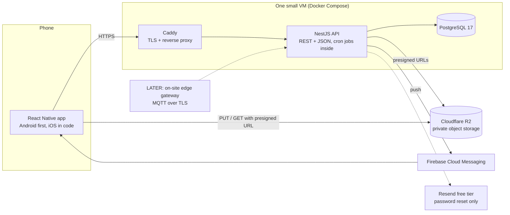
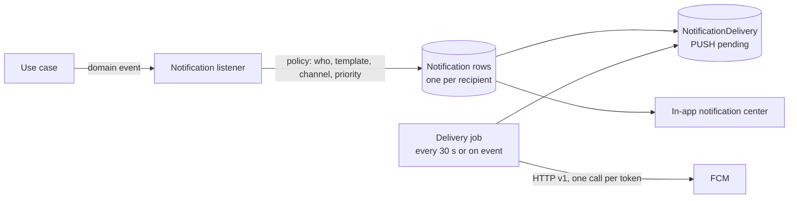

# Architecture

Short sentences. Big decisions first. Reasons next to each decision.

## 1. System overview



One process serves the API and runs scheduled jobs. That is enough for the first societies.
The scaling path in section 11 needs no schema change.

## 2. Decisions

| Area | Decision | Alternatives | Why |
| --- | --- | --- | --- |
| Tenancy | **Shared database, shared schema, `society_id` column on every tenant table.** Enforced in code from day one and by PostgreSQL row-level security before society #2. | Schema per society. Database per society. | Cheapest to run. Simplest migrations. Thousands of societies fit in one Postgres. Isolation comes from a mandatory scoped data layer plus RLS as a second lock. |
| Database | **PostgreSQL 17** | MySQL, MongoDB | Transactions, JSONB for per-society settings, RLS, advisory locks, mature and free. |
| ORM | **Prisma 7** (Rust-free client, `@prisma/adapter-pg`) | Drizzle, TypeORM, MikroORM | Best schema and migration workflow. Typed client. Client extensions give us the tenant-scoped client. Drizzle is the fallback if RLS ergonomics become a problem. |
| Contracts | **`@movo/contracts` with Zod 4 and a thin `defineRoute` helper.** One route object carries params, query, body, response. API validates with it. App calls with it. | ts-rest, tRPC, OpenAPI codegen | Zero duplicated types. About 200 lines we fully own. ts-rest's NestJS adapter fights Nest guards and its release pace slowed. tRPC is not REST and couples the app to server router types. |
| Validation | **Zod everywhere.** Backend pipe, app forms (react-hook-form + zod resolver), settings JSON, env files. | class-validator on the backend | One schema language. class-validator would duplicate every contract. |
| IDs | **UUID v7** generated in the app layer | serial integers, cuid | Time-sortable, no central counter, safe to expose. |
| Money | **Integer paise**, INR only | decimals, floats | No rounding bugs. |
| Auth | **Phone or email + password. Access JWT 15 min + rotating refresh token 30 days.** Passwords hashed with argon2id. | Sessions with cookies, Firebase Auth, OTP | Zero recurring cost. Standard mobile pattern. Provider table keeps OTP and social login as add-ons. |
| Mobile styling | **NativeWind 4.2 (Tailwind CSS 3.4)** with the `@movo/design-system` preset. Poppins font, Iconsax icons | NativeWind 5 (Tailwind 4, still release candidate), StyleSheet, Tamagui, Unistyles | You asked for Tailwind. v4 is the stable line. v5 upgrade is a config change later. |
| Navigation | **React Navigation 7** (native stack + bottom tabs) | Expo Router | No Expo. React Navigation is the standard for RN CLI apps. |
| Server state | **TanStack Query 5** with MMKV persistence | Redux, SWR | Caching, retries, offline reads for free. |
| Client state | **Zustand 5** for session, active society, UI preferences | Context, Redux | Small and explicit. Server data never lives here. |
| Storage | **MMKV** for cache and preferences, **Keychain/Keystore** for the refresh token | AsyncStorage | Fast, synchronous, encrypted where it matters. |
| Push | **FCM through `firebase-admin`** on the server and `@react-native-firebase/messaging` in the app | OneSignal, Expo push | Free. Covers Android and iOS (APNs via Firebase). Code ships now, project registration later. |
| Background jobs | **`@nestjs/schedule` cron inside the API process** with Postgres advisory locks | BullMQ + Redis, Temporal, separate worker | No Redis to pay for or babysit. Jobs are idempotent. Locks make a second instance safe. |
| Notification delivery | **Outbox table in Postgres** polled by an in-process job | direct send in request, message queue | Durable. Retries survive restarts. Swappable to a queue later. |
| Files | **Cloudflare R2, private bucket, presigned URLs** | S3, Supabase storage, local disk | 10 GB free, no egress fees, S3 API. |
| Email | **Resend free tier**, reset links only, behind an interface | SMTP from the VM, none | Free. Easy to remove. |
| i18n | **i18next** on the app and the server, resources in `@movo/i18n` | Lingui, FormatJS | Same resources render UI text and push notification text. Plural rules for hi and mr are built in. |
| Lint and format | **Biome** only | ESLint + Prettier | Your call, and it is faster. |
| Monorepo | **pnpm 10 + Turborepo 2** | Nx, Yarn workspaces | Your call. Same shape as heliogrid, which already builds on this machine. |
| Hosting | **One Oracle Cloud Always Free ARM VM in Mumbai with Docker Compose** (decisions doc, decision 2; Fly.io considered and dropped for cost on 2026-09-27) | PaaS free tiers that sleep, serverless | Cron and push need a process that never sleeps. Free PaaS tiers sleep. |
| Web admin | **LATER**, Next.js reusing the same contracts | build now | Phone-only admin is fine for one society. Bulk imports want a desktop later. |

## 3. Monorepo layout

```
movo/
  apps/
    api/                    NestJS. Modules by bounded context. Prisma schema and migrations.
    mobile/                 React Native CLI. Feature folders. NativeWind.
  packages/
    config/                 tsconfig presets.
    contracts/              Zod schemas, route definitions, enums (permissions, modules, errors, audit actions, notification categories), module settings schemas.
    i18n/                   en / hi / mr JSON resources per namespace, typed keys, format helpers (money, dates, Indian digit grouping).
    design-system/          tokens, Tailwind preset, fonts, React Native primitives.
  docs/
  infra/                    docker-compose.yml, Caddyfile, backup script, deploy workflow (added with the API).
```

Import rules (Turborepo boundaries will enforce them):

| Package | May import |
| --- | --- |
| contracts | zod only |
| i18n | contracts (for enum labels) |
| design-system | react, react-native, nativewind |
| mobile | contracts, i18n, design-system |
| api | contracts, i18n |

Nothing imports from an app. Business rules live in the API. The app renders.

## 4. Backend (NestJS)

### 4.1 Modules

Core modules are always on. Feature modules are switched per society by configuration.

| Kind | Module key | Owns |
| --- | --- | --- |
| core | identity | users, credentials, sessions, device tokens, account deletion |
| core | tenancy | societies, buildings, flats, memberships, occupancies, invitations, join requests, roles, permissions, module settings |
| core | notifications | notification rows, deliveries, preferences, FCM transport, templates |
| core | documents | upload intents, presigned URLs, access policy |
| core | audit | append-only audit log, list for admins |
| core | home | builds the Home summary from other modules (read-only) |
| feature | notices | notices, reads |
| feature | meetings | meetings, updates |
| feature | events | events, RSVPs |
| feature | directory | member cards with privacy applied |
| feature | parking | slots, allocations, vehicles |
| feature | tasks | tasks, categories, volunteering, verification |
| feature | responsibilities | rotations, participants, assignments, overrides |
| feature | rewards | rules, points ledger, redemption |
| feature | maintenance | billing plans, bills, payments, adjustments, receipts, collection view |
| feature | expenses | expenses, categories, approvals, reports |
| feature | vendors | vendors, categories |
| feature | emergency | contacts, alerts |
| feature | marketplace | listings, orders, order messages, reviews, network visibility |
| LATER | automation, visitors, complaints, assets | reserved keys |

### 4.2 Layers inside a module

```
notices/
  notices.controller.ts     thin: maps a route contract to a use case, nothing else
  application/              use cases (publishNotice, listNotices). Transactions, audit, events.
  domain/                   pure rules where they exist (audience resolution, pin limits). No framework imports.
  infrastructure/           Prisma repository. Only place that touches the database for this module.
  notices.module.ts
```

Rules
- Controllers do not contain business logic.
- Use cases receive a `TenantContext` and never a `societyId` from the request body.
- Repositories accept only the tenant-scoped Prisma client.
- Domain functions are pure and unit-tested (rotation engine, billing calculator, reward rules, audience resolution).

### 4.3 Request lifecycle

1. `AuthGuard` verifies the access JWT. Loads `userId` and `sessionId`.
2. `TenantContextInterceptor` reads `:societyId` from the route. Verifies an ACTIVE membership for this user in that society. Loads roles, permissions, enabled modules, settings into `TenantContext` (AsyncLocalStorage). No membership: 404, not 403, so society IDs cannot be probed.
3. `ModuleEnabledGuard` checks the route's module key against the society's enabled modules.
4. `PermissionGuard` checks `@RequirePermission('notice.publish')` against the membership's permission set.
5. `ZodValidationPipe` validates params, query, and body with the contract schemas.
6. The use case runs inside a transaction when it writes. It records audit rows and emits domain events in the same transaction.
7. The response is shaped by the contract's response schema. In development and tests, it is also validated.

Per-request permission data is cached in memory for 60 seconds per instance. Role changes take effect within a minute.

### 4.4 Tenant isolation, two locks

**Lock 1, code (MVP).** `TenantPrismaService.forCurrentTenant()` returns a Prisma client extension that:
- injects `societyId` into every `where` and `data` for models listed as tenant-scoped,
- throws if no tenant context exists (fail closed),
- exposes `platformScope(reason)` for the few cross-tenant jobs. Every use is logged with its reason and allowed only in listed modules: marketplace network queries, schedulers, platform admin.

A unit test asserts that every Prisma model with a `societyId` field is in the tenant-scoped list.

**Lock 2, database (before society #2).** Row-level security policies on every tenant table, keyed by `current_setting('app.society_id')`. The scoped client sets it with `SET LOCAL` at the start of each transaction. The API connects with a role that cannot bypass RLS. Migrations run with a separate admin role.

**Cross-tenant test suite.** For every tenant route, an integration test proves a member of society B gets 404 for society A's data. New routes fail CI until they are covered.

**Marketplace exception.** Listings with `visibility = NETWORK` are readable by members of any participating society. This is the only planned cross-tenant read. It runs under `platformScope('marketplace-network')`, shows seller name and society name only, and never exposes flat numbers.

### 4.5 Configuration-driven modules

- `SocietyModule` rows: `(societyId, moduleKey, enabled, settings JSONB, settingsVersion)`.
- Each module's settings schema is a Zod object in `@movo/contracts` with defaults. Settings are parsed on read, so old rows gain new defaults automatically.
- `GET /v1/me/context` returns memberships with roles, permissions, flats, enabled modules, and the public subset of settings. The app builds tabs, hub tiles, and buttons from it. Nothing about modules or roles is hard-coded in screens.

### 4.6 Domain events

Use cases emit typed events (`NoticePublished`, `PaymentRecorded`, `DutyAssigned`, ...) through Nest's `EventEmitter2`. Listeners in the notifications module turn events into notification rows. Events stay in-process. The outbox table makes delivery durable.

### 4.7 Scheduled jobs

| Job | Schedule (IST) | Idempotency |
| --- | --- | --- |
| Generate maintenance bills | daily 00:30 | unique `(planId, flatId, periodKey)` |
| Apply late fees | daily 01:00 | one LATE_FEE line per bill, amount recomputed |
| Advance duty rotations | hourly | assignment rows are materialised ahead; the job only flips statuses at boundaries |
| Send reminders (meetings, duties, dues) | every 5 min | `ReminderSent (entityId, kind)` row |
| Deliver notifications | every 30 s and on event | delivery row status |
| Expire invitations, prune sessions | daily 03:00 | plain updates |

Each job takes a Postgres advisory lock named after the job. A second API instance skips a job that is already running.

### 4.8 Files

As built (M10): photos live on the server's own disk (`FILES_DIR`, a Docker volume in production). ₹0 and no extra account. R2 or any S3 can replace the disk later behind `FilesService`.

Upload: the app resizes on the phone (1600 px, JPEG 80) and sends `POST /v1/societies/:id/files` as multipart (`file`). The API checks the first bytes (JPEG, PNG or WebP only, 5 MB at most), stores `<societyId>/<uuid>.<ext>` and returns `{id, url}`.
Download: `url` is a signed path `/v1/files/<id>?e=<expiry>&s=<hmac>`, valid until the end of the next hour, so an `<Image>` loads it without a login header and the same url stays stable for caching. Anything wrong or expired is a plain 404.
A file becomes "attached" when a listing uses it. Unattached uploads older than a day are removed nightly at 03:15 IST. Photos taken off a listing are deleted at once.

### 4.9 Audit

`AuditLog (societyId, actorUserId, membershipId, action, entityType, entityId, before, after, requestId, ip, createdAt)`, append-only, written inside the same transaction as the change. Actions are an enum in contracts. Audited: payments, bills, waivers, expenses and approvals, role and membership changes, configuration changes, task verification and point adjustments, duty overrides, alert resolution, vendor changes. Admins with `audit.view` can read it.

### 4.10 API conventions

- Base path `/v1`. Tenant routes: `/v1/societies/:societyId/...`. User routes: `/v1/me/...`. Platform routes: `/v1/platform/...`.
- Errors: `{ code, message, details?, requestId }`. Codes are an enum in contracts. The app maps codes to translated text. Server messages are for logs.
- Lists are cursor-paginated: `?cursor=&limit=`, response `{ items, nextCursor }`.
- Timestamps are ISO 8601 UTC. Period math uses the society time zone.
- Money fields end in `Paise` and are integers.
- Manual money entries (record payment, add expense) accept an `Idempotency-Key` header. A retried request never creates a duplicate.
- Additive changes only. Removals go through a deprecation window. `GET /v1/app/config` returns the minimum supported app version; the app shows a "please update" screen below it.

### 4.11 Observability

pino JSON logs with `requestId`, `userId`, `societyId`. Sentry free tier on both API and app. `/health` for uptime checks. No PII in logs.

## 5. Contracts

```ts
// packages/contracts/src/notices/notices.contract.ts
export const NoticeSchema = z.object({
  id: z.uuid(),
  title: z.string().min(1).max(120),
  body: z.string().max(5000),
  priority: z.enum(['NORMAL', 'IMPORTANT', 'EMERGENCY']),
  isPinned: z.boolean(),
  publishedAt: z.iso.datetime().nullable(),
});

export const noticesContract = {
  list: defineRoute({
    method: 'GET',
    path: '/v1/societies/:societyId/notices',
    module: 'notices',
    permission: null,                       // any active member
    params: z.object({ societyId: z.uuid() }),
    query: z.object({ cursor: z.string().optional(), limit: z.number().int().max(50).default(20) }),
    response: page(NoticeSchema),
  }),
  publish: defineRoute({
    method: 'POST',
    path: '/v1/societies/:societyId/notices',
    module: 'notices',
    permission: 'notice.publish',
    params: z.object({ societyId: z.uuid() }),
    body: CreateNoticeSchema,
    response: NoticeSchema,
  }),
};
```

Backend: `@Route(noticesContract.publish)` sets the HTTP method, path, module guard, permission guard, and validation pipe from the contract. The handler receives typed `params`, `query`, `body`.

App: `api.call(noticesContract.publish, { params, body })` returns the typed response. `queryKey(noticesContract.list, args)` builds a stable TanStack Query key that includes the society ID.

The route helper is about 200 lines: a `defineRoute` type, a Nest decorator plus pipe, a fetch client with auth refresh and error mapping, and the query key helper.

## 6. Authentication

**Identity.** `User` has optional `email` and optional `phone` (E.164, India default). At least one is required. Both are unique. `UserCredential` holds `type = PASSWORD` today, and `OTP_PHONE`, `GOOGLE`, `APPLE` later without touching `User`.

**Flows**
- Register: identifier + password + name + language. No society yet.
- Login: identifier + password → access JWT (15 min, contains `sub` and `sid` only) + refresh token (opaque 256-bit, 30 days, stored hashed, rotated on every use, reuse of an old token revokes the whole family).
- Refresh: the app refreshes silently. Roles and permissions are never inside the token. They are read per request, so a role change does not need a new login.
- Logout: revokes the session and deletes the device token.
- Reset: email link (10 minutes, single use) when the account has an email. Otherwise a society admin with `member.manage` issues an 8-digit one-time code, valid 15 minutes, shown once to the admin, logged in audit.
- Change password: needs the current password. Revokes other sessions.

**Storage on the phone.** Refresh token in Keychain/Keystore. Access token in memory only.

**Abuse controls.** `@nestjs/throttler`: 5 login attempts per minute per identifier and per IP. Backoff lockout after 10 failures. Password minimum 8 characters, checked against a small common-password list. Generic error text for wrong identifier or password.

**Account deletion.** Required by Google Play. Personal fields are anonymised, sessions revoked, device tokens removed, marketplace listings archived. Financial records keep a reference to the anonymised membership because the society's books need them.

**Onboarding gate.** A user with zero ACTIVE memberships sees only Join screens. Society IDs never come from the client unverified.

## 7. Mobile app

```
apps/mobile/src/
  app/            App.tsx, providers (query, i18n, theme, navigation), boot sequence
  core/
    api/          client from contracts, auth refresh, error mapping
    auth/         session store, token storage, guards
    tenant/       active society store, context query, module and permission helpers
    i18n/         i18next setup, locale detection, font family by locale
    navigation/   root, tabs, stacks, deep links, typed routes
    storage/      MMKV instances, query persister
    push/         FCM registration, foreground handling, deep-link routing
  features/
    home/ notices/ meetings/ events/ directory/ services/ parking/ tasks/ duties/
    rewards/ money/ emergency/ market/ me/ manage/
      screens/ components/ hooks/ (use cases as hooks) api.ts (query and mutation hooks)
  ui/             re-exports @movo/design-system plus app-only composites
```

Rules
- Screens compose components and hooks. No fetch, no business rules, no timers in screens.
- Server data comes only from TanStack Query hooks in `features/*/api.ts`. Query keys include the society ID.
- `useCan('notice.publish')` and `useModule('marketplace')` decide what renders. Both read the context query.
- Forms: react-hook-form with the contract Zod schema. The same rules as the server, so errors show before the round trip.
- Offline: persisted query cache shows the last data. Mutations fail fast with a clear message. No offline queue in v1.
- Fonts: Poppins for every locale. The `Text` primitive sets family and weight. No screen sets `fontFamily`.
- Environment: `react-native-config` for API URL and flags. No secrets in the app.
- Push: registration after login, token sent to `POST /v1/me/devices`. Foreground messages become an in-app toast. Taps route by the deep link in the payload.
- Minimum version gate at boot from `GET /v1/app/config`.

## 8. Localization

- Resources in `packages/i18n/src/locales/{en,hi,mr}/{namespace}.json`, one namespace per module plus `common`.
- English is the source. Missing keys in hi or mr fall back to English and are listed by a script so nothing ships silently untranslated.
- Typed keys: a generated `d.ts` from the English files, so a typo is a compile error.
- Fallback chain: user locale → society default locale → en.
- The server renders push titles and bodies with the same resources in the recipient's locale.
- Formatting through `Intl` with `en-IN`, `hi-IN`, `mr-IN`: ₹ and Indian digit grouping (₹12,40,000), dates, relative times. Wrapped in `@movo/i18n` helpers so no screen calls `Intl` directly.
- One font, Poppins, renders Latin and Devanagari. No per-locale font switching.
- Plurals use i18next's CLDR rules. Hindi and Marathi have `one` and `other`.
- Admin-written content stays in the language it was typed in. Multilingual fields are LATER.
- Adding a language: add a folder and add the locale to one list. Add a font only if the script is not Latin or Devanagari. No UI code changes.

## 9. Notifications



Categories: `NOTICE, MEETING, EVENT, TASK, DUTY, MAINTENANCE, EXPENSE, EMERGENCY, MARKETPLACE, MEMBERSHIP, SYSTEM`.

Default policies (each editable per society):

| Event | Recipients | Push | Timing |
| --- | --- | --- | --- |
| Notice published | audience | yes, high if IMPORTANT or EMERGENCY | now |
| Meeting scheduled or changed | audience | yes | now, plus reminders 24 h and 1 h before |
| Event published | audience | yes | now, plus 1 day before |
| Task assigned or verified | assignee | yes | now, plus due-date reminder |
| Duty period starts | flat members | yes | at start, 2 days before end if confirmation is on, on miss |
| Bill generated | flat members | yes | now, 3 days before due, on due, weekly while overdue (max 4) |
| Payment recorded | flat members | yes | now |
| Expense awaiting approval | approvers | yes | now |
| Emergency alert | society or configured roles | yes, high, sound | now |
| Marketplace order events | seller or buyer | yes | now |
| Membership approved, role changed | member | yes | now |

Anti-spam
- One push per event per recipient. Reminders are consolidated when several fall in the same hour.
- Preferences per category per society. `EMERGENCY` and `MEMBERSHIP` cannot be turned off.
- Quiet hours and daily digest are LATER.

As built (2026-09-27)
- Transport: `FcmPushTransport` (`apps/api/src/modules/notifications/fcm.transport.ts`) calls the FCM HTTP v1 API, `POST https://fcm.googleapis.com/v1/projects/<project_id>/messages:send`, one request per device token (v1 has no multicast), 8 at a time. The OAuth access token comes from a service-account JWT signed with `jose` (already a dependency, so no `google-auth-library` or `firebase-admin`), cached until a minute before it expires; a 401 fetches a new one once.
- Chosen at boot in `NotificationsModule`: FCM when `FIREBASE_SERVICE_ACCOUNT_JSON` parses as a service account, else `NoopPushTransport` (logs, marks `SKIPPED`).
- Payload: `notification {title, body}`, `data` = the notification's data as strings plus `notificationId`, `societyId`, `category`; `android.priority` HIGH and channel `emergency` for `EMERGENCY`, NORMAL and channel `default` otherwise.
- `DeliveryJob` (every 30 s, advisory lock): skips a delivery when the member muted that category for that society (`NotificationPreference.pushEnabled = false`; no screen for it yet) or has no device; SENT when any device accepted it; `UNREGISTERED` or an invalid-token `INVALID_ARGUMENT` deletes that `DeviceToken`; 429, 5xx and network errors leave it `PENDING` for the next run, `FAILED` after 5 attempts.
- App (`apps/mobile/src/core/push`): `@react-native-firebase/app` and `messaging`. Once signed in with a society, Android 13+ asks once for `POST_NOTIFICATIONS`, then the FCM token is registered through `POST /v1/me/devices` and re-registered on refresh; sign-out removes it (`DELETE /v1/me/devices`) before the session is cleared. Foreground messages show a toast and refresh the notification list and home. Taps (background and cold start) switch to the notification's society if needed, open the same screen as the notification center (`openNotificationTarget`), and mark it read.
- Android channels, created in `MainApplication.kt`: `default` ("Society updates", default importance) and `emergency` ("Emergency alerts", high, sound). Small icon `ic_notification` (white "M"), color `#151515`; default channel and color are set in `apps/mobile/firebase.json`.
- Without Firebase: no `google-services.json` means the Gradle plugin is not applied and no Firebase app exists, so every push call in the app is a no-op; the API marks deliveries `SKIPPED`.

Firebase provisioning: step by step in `docs/08-release-and-ops.md`, section 6, "Firebase (push)". iOS later: upload an APNs key to Firebase and add `GoogleService-Info.plist`.

## 10. Security and privacy

| Threat | Control |
| --- | --- |
| Cross-tenant read or write (IDOR) | tenant-scoped client, membership check on every tenant route, RLS, 404 for foreign societies, cross-tenant test suite |
| Client-supplied roles or society IDs | roles come from the database per request; society ID from the URL is verified against membership |
| Privilege escalation | permission guard on every mutating route; role changes audited; nobody can grant a permission they do not hold |
| Credential stuffing, brute force | throttling per identifier and IP, lockout with backoff, argon2id |
| Token theft | short access token, rotating refresh tokens with reuse detection, Keychain storage |
| File leaks | private bucket, presigned URLs for minutes, access policy per document owner |
| Injection | Prisma parameterised queries, Zod validation, no raw SQL from input |
| Mass assignment | strict Zod objects (`.strict()`) on every body |
| Data exposure | privacy settings applied in the directory query, not in the app; no PII in logs; generic error messages |
| Secrets | env files on the VM only, `.gitignore`d, GitHub Actions secrets for deploy |
| Availability | rate limits, request size limits, health checks, nightly backups with a restore drill |
| India DPDP Act basics | consent at sign-up, purpose-limited data, in-app deletion, privacy policy page |

## 11. Infrastructure and cost

| Component | Choice | Monthly cost |
| --- | --- | --- |
| Compute | one Oracle Cloud Always Free Ampere A1 VM (`VM.Standard.A1.Flex`, 2 OCPU / 12 GB, Ubuntu 24.04 aarch64) in Mumbai (`ap-mumbai-1`); account upgraded to Pay As You Go so the idle free VM is not reclaimed | ₹0 |
| Database | PostgreSQL 17 in Docker on the same VM, no public port | ₹0 |
| Uploaded photos | `files` Docker volume on the VM (`FILES_DIR=/data/files`) | ₹0 |
| Backups | nightly `pg_dump` + photo mirror on the VM, 14 daily + 6 monthly kept, off-site copy with rclone to Oracle Object Storage (Always Free 20 GB) or Cloudflare R2, monthly restore drill | ₹0 |
| TLS and proxy | Caddy with Let's Encrypt | ₹0 |
| Domain | free DuckDNS subdomain first; a bought domain later | ₹0 (about ₹100 per month equivalent if bought) |
| Push | FCM | ₹0 |
| Email | Resend free tier | ₹0 |
| Errors and uptime | Sentry free (not wired yet); healthchecks.io free: API heartbeat every 5 min (`UPTIME_HEARTBEAT_URL`) and nightly backup heartbeat | ₹0 |
| CI | GitHub Actions free minutes | ₹0 |
| Android | Play Console | $25 once |
| iOS | Apple Developer | $99 per year, LATER |

Deployment
- `infra/docker-compose.prod.yml`: `api`, `postgres`, `caddy`, `backup`. Details in [08-release-and-ops.md](08-release-and-ops.md).
- GitHub Actions on `main`: `ci.yml` (lint, typecheck, tests), then `deploy.yml` builds the API image for linux/arm64 (the VM) and linux/amd64, pushes it to GHCR, SSHes to the VM, `docker compose pull && up -d` in `/opt/movo`, and waits for the api health check. Skipped until the `DEPLOY_*` secrets exist. The API runs `prisma migrate deploy` on start.

Reliability on a free VM
- Reclaim: Oracle may reclaim idle Always Free instances on free-tier accounts; the Pay As You Go upgrade removes that (Always Free limits still bill ₹0). A billing alert (budget ₹1) catches accidental paid resources.
- Restarts: every container has `restart: unless-stopped`; Docker starts on boot, so a VM reboot brings the stack back.
- Detection: healthchecks.io emails when the API heartbeat (every 5 min, only sent while the database answers) or the nightly backup ping stops.
- Recovery: off-site dumps and photos in Object Storage or R2; a new VM from the runbook plus a restore takes about an hour. Monthly restore drill proves it.
- Patching: `unattended-upgrades` for security updates, SSH keys only, only ports 22, 80 and 443 open.
- Android release APK or AAB is built on tags. Debug builds are local.
- Environments: `local` (Docker Postgres on your Mac) and `prod`. Staging is added when a second society arrives.

Scaling path, none of which changes the schema
- 10 societies: nothing.
- 100 societies: managed Postgres, second API instance behind Caddy, jobs already lock.
- 1,000 societies: separate worker process for jobs, Redis queue for delivery, CDN in front of R2, read replica for reports.

## 12. Testing

- Unit tests (Vitest) for pure domain logic: rotation engine, billing calculator, late fees, reward rules and caps, audience resolution, permission evaluation, Zod settings defaults.
- API integration tests against a Docker Postgres: auth flows, invitation flows, the cross-tenant suite, money flows with idempotency.
- Contract tests: every route's response passes its response schema in tests.
- Mobile: type-checking and a few component tests for primitives. Maestro smoke flow on Android when the app is stable.
- No test is written for coverage alone.

## 13. Future automation readiness

- An on-site edge gateway (small Linux box) talks MQTT over TLS to a broker on the same VM. The API ingests `DeviceEvent`s, evaluates rules, and creates `Alert`s.
- `Alert` is already generic in the data model: `source = USER | DEVICE`. Emergency alerts use it today.
- Notification category `AUTOMATION` is reserved. Module key `automation` is reserved.
- Water: the existing motor panel keeps control. New sensors only observe (levels, flow, current) and can trigger the panel's own remote input when explicitly enabled.
- CCTV: the existing DVR's RTSP streams feed the edge box. Detection runs on-site. Only events and clips go to the cloud.
- Nothing in the MVP schema or API must change for this.

## 14. Risks and trade-offs

| Risk | Impact | Mitigation |
| --- | --- | --- |
| Single VM, single process | downtime on host failure | Docker Compose is reproducible in minutes, nightly off-site backups, healthchecks.io alerts. Accepted for a free MVP. |
| Oracle free tier reclaim or out-of-capacity | sudden downtime, or no VM at signup | Pay As You Go upgrade (still ₹0), off-site backups, healthchecks.io alerts; paid VPS fallback runs the same compose file |
| Manual payment entry | treasurer effort, typos | bulk "mark paid" screen, idempotency keys, resident notified so errors are caught fast |
| Push unreliability on some Android brands | missed reminders | in-app notification center is the source of truth, high-priority channel for alerts, "allow background" hint once |
| Devanagari rendering | clipped or mismatched text | Poppins ships Devanagari, generous line heights, screenshots reviewed in all three languages |
| pnpm + React Native quirks | build friction | the same setup builds heliogrid on this machine; `node-linker=hoisted` is the fallback |
| NativeWind version churn | rework | v4 stable now, tokens live outside NativeWind, upgrade is a config change |
| JSONB settings drift | broken configs | Zod parse with defaults on every read, `settingsVersion`, tests for defaults |
| Marketplace cross-tenant read | privacy leak | the only cross-tenant read, explicit scope, seller card hides flat, moderation tools |
| Reward credit is money-like | disputes | society-controlled rules, caps, FY expiry, audit, approval step for redemption |
| No Apple account | iOS untested on devices | simulator builds in CI keep the iOS code compiling |

## 15. Implementation notes (as built, 2026-09-26)

Things the code does that the sections above only imply.

- **Prisma 7** runs without the Rust engine and needs a driver adapter: `@prisma/adapter-pg` over `pg`. The generated client lives in `apps/api/src/generated` (gitignored, created by `prisma generate` on install). Config is `apps/api/prisma.config.ts`, which reads `.env` through `dotenv`.
- **Decorator metadata.** NestJS DI needs `emitDecoratorMetadata`. `tsx` and esbuild do not emit it, so development runs `nest start --watch` (tsc) and tests run Vitest with `unplugin-swc`. Do not switch the API to `tsx`.
- **Tenant client.** `TenantPrismaService` wraps the Prisma client with a query extension that injects `societyId` from the request store into every read and write on tenant models, and throws when there is no tenant context. Services still pass `societyId` explicitly on `create` so the types stay honest. The list of tenant models is `TENANT_MODELS` in `tenant-prisma.service.ts`; add every new tenant table there.
- **Request store.** `AsyncLocalStorage` opened by an Express middleware holds `requestId`, the user and the tenant context. Services read it with `requireUser()` and `requireTenant()`; nothing is passed through parameters.
- **One guard.** `RouteGuard` reads the contract attached by `@Route()` and applies, in order: bearer token, live session, active user, platform admin, membership, module switch, permission. `ThrottlerGuard` runs before it and is skipped in tests.
- **Contract validation both ways.** `@Input(contract)` validates params, query and body. `ResponseValidationInterceptor` validates responses outside production and throws in tests, so drift fails CI.
- **Notifications** are written per recipient in the recipient's language using the shared i18n resources, plus a `PUSH` delivery row. `DeliveryJob` runs every 30 seconds under a Postgres advisory lock. The transport is a no-op logger until a Firebase service account is configured.
- **Mobile session.** The refresh token is in the Keychain; the access token and profile are in MMKV for a warm start. The API client refreshes once on 401 and signs out locally when refresh fails. All React Query keys start with the society id.
- **Fonts.** Poppins is registered on Android through `res/font/poppins.xml` and `ReactFontManager` in `MainApplication.kt`, and linked on iOS through `react-native.config.js`. `fontFamily: 'Poppins'` plus `fontWeight` works on both.
- **Metro and pnpm.** `metro.config.js` watches the repo root. NativeWind needs `react-native-css-interop` as a direct dependency of the app, and Zod 4 needs `@babel/plugin-transform-export-namespace-from` in `babel.config.js`.
