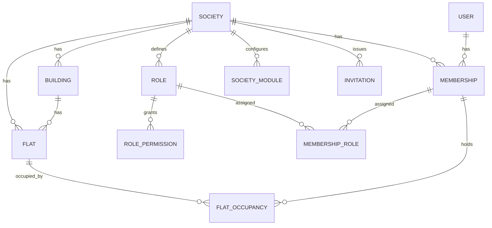

# Data model

PostgreSQL. Prisma schema is generated from this document when the API is scaffolded.

## 1. Conventions

- Primary keys are UUID v7, column `id`.
- Every tenant table has `society_id` (indexed, part of most unique keys). Global tables are listed in section 12.
- `created_at`, `updated_at` on every table. No soft-delete flags. Rows carry a `status` instead, so history stays readable.
- Money is `integer` paise. Column names end in `_paise`.
- Time is `timestamptz`. Dates without time (`due_date`, `period_start`) are `date`, interpreted in the society time zone.
- Per-society settings are JSONB validated by Zod schemas in `@movo/contracts`.
- Enums are Postgres enums, mirrored in contracts.
- `audience` is a JSONB value shared by notices, meetings, events: `{ type: 'ALL' | 'ROLES' | 'BUILDINGS' | 'FLATS', ids: [] }`.

## 2. Core: identity

| Table | Key fields |
| --- | --- |
| user | email (unique, nullable), phone (unique, nullable, E.164), display_name, avatar_document_id, locale (`en`/`hi`/`mr`), status (`ACTIVE`, `DELETED`), deleted_at |
| user_credential | user_id, type (`PASSWORD` now; `OTP_PHONE`, `GOOGLE`, `APPLE` later), secret_hash, provider_subject, verified_at |
| refresh_session | user_id, token_hash, family_id, device_name, platform, expires_at, revoked_at, replaced_by_id, last_used_at, ip |
| device_token | user_id, fcm_token (unique), platform, app_version, last_seen_at |
| password_reset | user_id, code_hash, kind (`EMAIL_LINK`, `ADMIN_CODE`), issued_by_user_id, expires_at, used_at |
| platform_admin | user_id (unique). Marks us. Never visible in society UI. |

## 3. Core: tenancy

| Table | Key fields |
| --- | --- |
| society | name, slug (unique), logo_document_id, address, city, state, pincode, geo (nullable), timezone (`Asia/Kolkata`), default_locale, currency (`INR`), fy_start_month (4), join_code (nullable, rotatable), join_requests_enabled, status |
| building | society_id, name (wing), floors_count, sort_order |
| flat | society_id, building_id (nullable), number, floor, type (`1BHK`...), area_sqft (nullable), status (`OCCUPIED`, `VACANT`, `INACTIVE`). Unique (society_id, building_id, number) |
| membership | society_id, user_id, status (`INVITED`, `PENDING_APPROVAL`, `ACTIVE`, `SUSPENDED`, `LEFT`), joined_at, left_at, privacy (JSONB: show_phone, show_email, show_vehicles), notes (admin only). Unique (society_id, user_id) |
| role | society_id, key, name (JSONB per locale), is_system, sort_order. Seeded from templates per society |
| role_permission | role_id, permission_key. Permission keys are code-defined (see doc 04) |
| membership_role | membership_id, role_id |
| flat_occupancy | society_id, flat_id, membership_id, relation (`OWNER`, `TENANT`, `FAMILY`, `OTHER`), is_primary_contact, from_date, to_date (nullable) |
| invitation | society_id, code (8 chars, unique), flat_id (nullable), role_id, relation, invitee_name, email, phone, invited_by_membership_id, expires_at, status (`PENDING`, `ACCEPTED`, `EXPIRED`, `REVOKED`), accepted_membership_id |
| join_request | society_id, user_id, flat_id, relation_claimed, message, status (`PENDING`, `APPROVED`, `REJECTED`), decided_by_membership_id, decided_at |
| society_module | society_id, module_key, enabled, settings (JSONB), settings_version. Unique (society_id, module_key) |

One user, many memberships. One membership, many flats through occupancy. One flat, many occupants over time.

## 4. Parking

| Table | Key fields |
| --- | --- |
| parking_slot | society_id, code, type (`TWO_WHEELER`, `FOUR_WHEELER`, `EV`, `OTHER`), level, status (`ACTIVE`, `BLOCKED`, `VISITOR`) |
| parking_allocation | society_id, slot_id, flat_id, from_date, to_date, notes, allocated_by_membership_id. One active allocation per slot (partial unique index) |
| vehicle | society_id, flat_id, registration_no (normalised `MH12AB1234`, unique per society), type, make_model, color |

## 5. Communication

| Table | Key fields |
| --- | --- |
| notice | society_id, title, body, category, priority (`NORMAL`, `IMPORTANT`, `EMERGENCY`), is_pinned, audience, attachments (document ids), published_at, expires_at, status (`DRAFT`, `PUBLISHED`, `ARCHIVED`), created_by_membership_id |
| notice_read | notice_id, membership_id, read_at |
| meeting | society_id, title, agenda, starts_at, ends_at (nullable), location, audience, status (`SCHEDULED`, `CANCELLED`, `COMPLETED`), created_by_membership_id. A move is a `RESCHEDULED` update, not a status. Reminder hours come from the `meetings` module settings |
| meeting_update | society_id, meeting_id, kind (`RESCHEDULED`, `NOTE`, `CANCELLED`, `COMPLETED`), body, previous_starts_at, created_by_membership_id. LATER: attendance, minutes, decisions, action items |
| event (Prisma model `SocietyEvent`) | society_id, title, description, starts_at, ends_at (nullable), location, rsvp_enabled, audience, status (`PUBLISHED`, `CANCELLED`). LATER: cover image |
| event_rsvp | society_id, event_id, membership_id, response (`GOING`, `NOT_GOING`, `MAYBE`), guests_count (only for `GOING`, max 10). Primary key (event_id, membership_id) |

## 6. Tasks, duties, rewards

| Table | Key fields |
| --- | --- |
| task | society_id, title, description, points, due_on, assignee_membership_id (nullable = open for volunteers), status (`OPEN`, `IN_PROGRESS`, `SUBMITTED`, `COMPLETED`, `CANCELLED`), submission_note, submitted_at, completed_at, verified_by_membership_id, created_by_membership_id. LATER: categories, evidence photos |
| task_event | society_id, task_id, kind (`CREATED`, `ASSIGNED`, `VOLUNTEERED`, `WITHDRAWN`, `SUBMITTED`, `RETURNED`, `VERIFIED`, `CANCELLED`), note, by_membership_id |
| responsibility | society_id, title, description, participant_kind (`FLAT`, `MEMBER`), period_unit (`DAY`, `WEEK`, `MONTH`), period_length, start_date, requires_confirmation, on_miss (`MARK_MISSED`, `CARRY_OVER`), points (nullable), status (`ACTIVE`, `PAUSED`, `ENDED`), created_by_membership_id |
| responsibility_participant | responsibility_id, position, flat_id or membership_id, active |
| responsibility_assignment | society_id, responsibility_id, period_index, period_start, period_end, flat_id or membership_id, status (`UPCOMING`, `ACTIVE`, `COMPLETED`, `MISSED`, `SKIPPED`, `OVERRIDDEN`), confirmed_at, confirmed_by_membership_id, override_reason. Unique (responsibility_id, period_index) |
| points_ledger | society_id, membership_id, delta, reason (`TASK`, `DUTY`, `ADJUSTMENT`; `REDEEMED`, `EXPIRED` in 1.5), label, ref_type, ref_id, financial_year (`2026-27`), created_by_membership_id. Append-only. Balance = sum |
| redemption | society_id, membership_id, flat_id, points, credit_paise, status (`REQUESTED`, `APPROVED`, `REJECTED`, `APPLIED`), applied_bill_id, decided_by_membership_id |

Rotation rule: assignments are materialised 12 periods ahead, continuing the order after whoever had the last turn. Changing participants, resuming or carrying a missed turn over regenerates only `UPCOMING` rows. Overrides write the affected rows explicitly. The hourly job flips `UPCOMING → ACTIVE` at `period_start` and `ACTIVE → COMPLETED or MISSED` after `period_end`. Marking a turn done completes it at once.

## 7. Money: maintenance

| Table | Key fields |
| --- | --- |
| billing_plan | society_id, name, frequency (`MONTHLY`, `QUARTERLY`, `HALF_YEARLY`, `YEARLY`; longer periods line up with the financial year), amount_rule (`FLAT_RATE`, `PER_SQFT`), amount_paise (per bill, or per sq ft), due_day (1-28), generate_days_before, late_fee (JSONB: `NONE` / `FIXED` / `PERCENT` in basis points / `PER_DAY`, grace_days, cap_paise), active_from, active_to, is_active. A per-flat amount is a flat_charge_override |
| flat_charge_override | plan_id, flat_id, amount_paise |
| bill | society_id, flat_id, plan_id (nullable for ad hoc), kind (`MAINTENANCE`, `ADHOC`), title, period_key (`2026-10`, `2026-27-Q1`, `2026-27-H1`, `2026-27`), due_date, financial_year, total_paise, paid_paise, status (`DUE`, `PARTIALLY_PAID`, `PAID`, `OVERDUE`, `WAIVED`), late_fee_waived, waived_reason. Unique (plan_id, flat_id, period_key) |
| bill_line | society_id, bill_id, type (`BASE`, `LATE_FEE`), label, amount_paise. Unique (bill_id, type) |
| payment | society_id, flat_id, amount_paise, paid_on, method (`CASH`, `UPI`, `BANK_TRANSFER`, `CHEQUE`, `OTHER`), reference, receipt_no (`R-2026-27-0001`, from receipt_counter), financial_year, notes, recorded_by_membership_id, status (`RECORDED`, `REVERSED`), reversed_reason, idempotency_key. Unique (society_id, receipt_no) and (society_id, idempotency_key). LATER: receipt_document_id |
| payment_allocation | society_id, payment_id, bill_id, amount_paise. Oldest bill first by default, treasurer may choose. Money not allocated is advance and is used on the next bills |
| receipt_counter | society_id, financial_year, last_no |
| flat_adjustment | LATER (with reward redemption in 1.5). Waivers are a bill status, advance is unallocated payment |
| payment_instruction | society_id, kind (`UPI`, `BANK`, `OTHER`), label, value, payee_name, is_active, sort_order. Shown under "How to pay"; UPI ones get a upi://pay link |

Flat balance = sum of open bills' (total − paid). Advance = sum(payment.amount) − sum(allocations) over recorded payments. Collection status per flat is derived from bills of the current period.

## 8. Money: expenses

| Table | Key fields |
| --- | --- |
| expense_category | society_id, key (seeded ones, for translated names), name, icon, sort_order. Unique (society_id, name) |
| expense | society_id, category_id, amount_paise, incurred_on, payee_name, description, method, reference, status (`PENDING`, `APPROVED`, `REJECTED`), financial_year, created_by_membership_id, decided_by_membership_id, decided_at, rejection_reason, idempotency_key. Unique (society_id, idempotency_key). LATER: receipts (document ids), vendor link |
| income_entry | society_id, kind (`DONATION`, `INTEREST`, `HALL_BOOKING`, `PENALTY`, `OTHER`), amount_paise, received_on, description, financial_year, created_by_membership_id. Small table so reports can show total income beyond maintenance |

Approval rule comes from settings: `NEVER`, `ABOVE_AMOUNT`, `ALWAYS`. The creator cannot approve their own expense.

## 9. Services, emergency, documents

| Table | Key fields |
| --- | --- |
| vendor_category | society_id, key (seeded ones only, for translated names), name, icon, sort_order (seeded from platform defaults) |
| vendor | society_id, category_id, name, phone, alt_phone, description, availability, status (`SUGGESTED`, `APPROVED`, `TRIAL`, `BLOCKED`), admin_notes, added_by_membership_id. Members suggest, the committee approves |
| emergency_contact | society_id, label, phone, type (`MEDICAL`, `FIRE`, `POLICE`, `SECURITY`, `LIFT`, `ADMIN`, `OTHER`), sort_order, is_public_number |
| alert | society_id, source (`USER`, `DEVICE`), type (`MEDICAL`, `FIRE`, `SECURITY`, `LIFT`, `GAS`, `OTHER`), raised_by_membership_id, flat_id, message, status (`ACTIVE`, `RESOLVED`, `FALSE_ALARM`), resolved_by_membership_id, resolved_at, resolution_note |
| document | society_id (nullable for profile photos), owner_user_id, kind (`RECEIPT`, `EXPENSE_RECEIPT`, `NOTICE_ATTACHMENT`, `TASK_EVIDENCE`, `LISTING_IMAGE`, `AVATAR`, `LOGO`, `OTHER`), storage_key, mime, size_bytes, status (`PENDING`, `READY`, `DELETED`) |

## 10. Marketplace (built in M10)

| Table | Key fields |
| --- | --- |
| stored_file | society_id, owner_membership_id, kind (`LISTING_IMAGE`), mime, size_bytes, storage_key, attached_at (null = not used yet, removed after a day) |
| listing | society_id, seller_membership_id, kind (`FOOD`, `PRODUCT`, `SERVICE`, `RESALE`), title, description, price_type (`FIXED`, `PER_UNIT`, `NEGOTIABLE`, `FREE`), price_paise, unit, diet (`VEG`, `EGG`, `NON_VEG`, food only, required), quantity_available (null = no limit), ready_at and order_by (food), fulfilment (`PICKUP`, `DELIVERY`, `BOTH`), condition (resale), visibility (`SOCIETY`, `NETWORK`), show_phone_after_accept, status (`ACTIVE`, `PAUSED`, `ARCHIVED`, `HIDDEN`), hidden_reason, rating_sum, rating_count |
| listing_image | listing_id, file_id, sort_order (first = cover), at most 5 |
| market_order | listing_id, buyer and seller membership ids, quantity, unit_price_paise (snapshot), fulfilment, note, status (`REQUESTED`, `ACCEPTED`, `REJECTED`, `READY`, `COMPLETED`, `CANCELLED`), reason, accepted_at, ready_at, closed_at, buyer_read_at, seller_read_at |
| order_message | order_id, sender_membership_id, body |
| listing_review | order_id (unique), listing_id, author, rating 1–5, text. Only the buyer, only after `COMPLETED` |
| listing_report | listing_id, reporter_membership_id, reason, status (`OPEN`, `ACTIONED`, `DISMISSED`) |

Rules: stock goes down when the seller accepts (race-safe, never below zero) and comes back if an accepted order is cancelled. No orders after `order_by`. Food ready more than 12 hours ago leaves the feed. One open order per buyer per listing. Flats and the seller's phone (if shared) appear only after acceptance. A moderator hiding a listing cancels its open orders and closes its reports. Browsing other societies (`NETWORK`) is stored now and shown when the network arrives in phase 2.

## 11. Notifications and audit

| Table | Key fields |
| --- | --- |
| notification | user_id, society_id (nullable), category, title, body, data (JSONB deep link), read_at |
| notification_delivery | notification_id, channel (`PUSH`, `EMAIL`), status (`PENDING`, `SENT`, `FAILED`, `SKIPPED`), attempts, last_error, sent_at |
| notification_preference | user_id, society_id, category, push_enabled |
| reminder_sent | society_id, entity_type, entity_id, kind (`before-24h`), sent_at. Unique (entity_type, entity_id, kind). Prevents duplicate reminders; cleared when the item moves |
| audit_log | society_id (nullable), actor_user_id, membership_id, action, entity_type, entity_id, before (JSONB), after (JSONB), request_id, ip, created_at |

## 12. Global tables (no society_id)

`user`, `user_credential`, `refresh_session`, `device_token`, `password_reset`, `platform_admin`, `society`, `notification`, `notification_delivery`, `notification_preference` (has society_id but is user-owned), `document` (nullable society_id), `order` and `order_message` (span two societies; scoped by participant).

Everything else is tenant-scoped and goes through the scoped client and RLS.

## 13. Indexes worth naming now

- `membership (user_id, status)` for the context query.
- `bill (society_id, flat_id, status)` and `bill (society_id, period_key)` for Home and collection views.
- `notification (user_id, read_at, created_at desc)`.
- `responsibility_assignment (society_id, status, period_end)` for the hourly job.
- `listing (visibility, status, category)` for network browsing.
- `audit_log (society_id, created_at desc)`.
