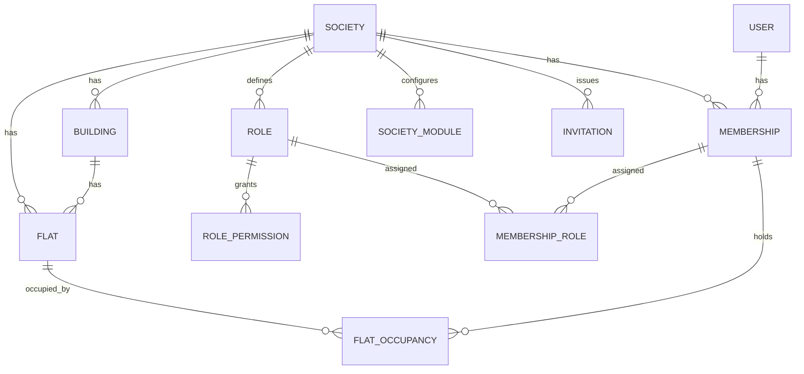

# Data model

PostgreSQL. Prisma schema is generated from this document when the API is scaffolded.

## 1. Conventions

- Primary keys are UUID v7, column `id`.
- Every tenant table has `society_id` (indexed, part of most unique keys). Global tables are listed in section 12.
- `created_at`, `updated_at` on every table. No soft-delete flags. Rows carry a `status` instead, so history stays readable.
- Money is `integer` paise. Column names end in `_paise`.
- Time is `timestamptz`. Dates without time (`due_date`, `period_start`) are `date`, interpreted in the society time zone.
- Per-society settings are JSONB validated by Zod schemas in `@movo/contracts`.
- Enums are Postgres enums, mirrored in contracts.
- `audience` is a JSONB value shared by notices, meetings, events: `{ type: 'ALL' | 'ROLES' | 'BUILDINGS' | 'FLATS', ids: [] }`.

## 2. Core: identity

| Table | Key fields |
| --- | --- |
| user | email (unique, nullable), phone (unique, nullable, E.164), display_name, avatar_document_id, locale (`en`/`hi`/`mr`), status (`ACTIVE`, `DELETED`), deleted_at |
| user_credential | user_id, type (`PASSWORD` now; `OTP_PHONE`, `GOOGLE`, `APPLE` later), secret_hash, provider_subject, verified_at |
| refresh_session | user_id, token_hash, family_id, device_name, platform, expires_at, revoked_at, replaced_by_id, last_used_at, ip |
| device_token | user_id, fcm_token (unique), platform, app_version, last_seen_at |
| password_reset | user_id, code_hash, kind (`EMAIL_LINK`, `ADMIN_CODE`), issued_by_user_id, expires_at, used_at |
| platform_admin | user_id (unique). Marks us. Never visible in society UI. |

## 3. Core: tenancy

| Table | Key fields |
| --- | --- |
| society | name, slug (unique), logo_document_id, address, city, state, pincode, geo (nullable), timezone (`Asia/Kolkata`), default_locale, currency (`INR`), fy_start_month (4), join_code (nullable, rotatable), join_requests_enabled, status |
| building | society_id, name (wing), floors_count, sort_order |
| flat | society_id, building_id (nullable), number, floor, type (`1BHK`...), area_sqft (nullable), status (`OCCUPIED`, `VACANT`, `INACTIVE`). Unique (society_id, building_id, number) |
| membership | society_id, user_id, status (`INVITED`, `PENDING_APPROVAL`, `ACTIVE`, `SUSPENDED`, `LEFT`), joined_at, left_at, privacy (JSONB: show_phone, show_email, show_vehicles), notes (admin only). Unique (society_id, user_id) |
| role | society_id, key, name (JSONB per locale), is_system, sort_order. Seeded from templates per society |
| role_permission | role_id, permission_key. Permission keys are code-defined (see doc 04) |
| membership_role | membership_id, role_id |
| flat_occupancy | society_id, flat_id, membership_id, relation (`OWNER`, `TENANT`, `FAMILY`, `OTHER`), is_primary_contact, from_date, to_date (nullable) |
| invitation | society_id, code (8 chars, unique), flat_id (nullable), role_id, relation, invitee_name, email, phone, invited_by_membership_id, expires_at, status (`PENDING`, `ACCEPTED`, `EXPIRED`, `REVOKED`), accepted_membership_id |
| join_request | society_id, user_id, flat_id, relation_claimed, message, status (`PENDING`, `APPROVED`, `REJECTED`), decided_by_membership_id, decided_at |
| society_module | society_id, module_key, enabled, settings (JSONB), settings_version. Unique (society_id, module_key) |

One user, many memberships. One membership, many flats through occupancy. One flat, many occupants over time.

## 4. Parking

| Table | Key fields |
| --- | --- |
| parking_slot | society_id, code, type (`TWO_WHEELER`, `FOUR_WHEELER`, `EV`, `OTHER`), level, status (`ACTIVE`, `BLOCKED`, `VISITOR`) |
| parking_allocation | society_id, slot_id, flat_id, from_date, to_date, notes. One active allocation per slot |
| vehicle | society_id, flat_id, registration_no, type, make_model, color |

## 5. Communication

| Table | Key fields |
| --- | --- |
| notice | society_id, title, body, category, priority (`NORMAL`, `IMPORTANT`, `EMERGENCY`), is_pinned, audience, attachments (document ids), published_at, expires_at, status (`DRAFT`, `PUBLISHED`, `ARCHIVED`), created_by_membership_id |
| notice_read | notice_id, membership_id, read_at |
| meeting | society_id, title, agenda, description, starts_at, ends_at, location, audience, status (`SCHEDULED`, `RESCHEDULED`, `CANCELLED`, `COMPLETED`), reminder_policy (JSONB), created_by_membership_id |
| meeting_update | meeting_id, kind (`RESCHEDULED`, `NOTE`, `CANCELLED`, `COMPLETED`), body, created_by_membership_id. LATER: attendance, minutes, decisions, action items |
| event | society_id, title, description, starts_at, ends_at, location, cover_document_id, images, rsvp_enabled, audience, status |
| event_rsvp | event_id, membership_id, response (`GOING`, `NOT_GOING`, `MAYBE`), guests_count |

## 6. Tasks, duties, rewards

| Table | Key fields |
| --- | --- |
| task_category | society_id, name, icon, default_points, sort_order |
| task | society_id, category_id, title, description, priority, due_at, assignee_membership_id (nullable = open for volunteers), status (`OPEN`, `IN_PROGRESS`, `SUBMITTED`, `COMPLETED`, `CANCELLED`), points (snapshot at creation, admin may override within rules), evidence (document ids), submitted_at, completed_at, verified_by_membership_id |
| task_event | task_id, kind (`CREATED`, `VOLUNTEERED`, `ASSIGNED`, `SUBMITTED`, `VERIFIED`, `REJECTED`, `COMMENT`), body, by_membership_id |
| responsibility | society_id, title, description, participant_kind (`FLAT`, `MEMBER`), period_unit (`DAY`, `WEEK`, `MONTH`), period_length, start_date, requires_confirmation, on_miss (`MARK_MISSED`, `CARRY_OVER`), reminder_policy, points (nullable), status (`ACTIVE`, `PAUSED`, `ENDED`) |
| responsibility_participant | responsibility_id, position, flat_id or membership_id, active |
| responsibility_assignment | society_id, responsibility_id, period_index, period_start, period_end, flat_id or membership_id, status (`UPCOMING`, `ACTIVE`, `COMPLETED`, `MISSED`, `SKIPPED`, `OVERRIDDEN`), confirmed_at, confirmed_by_membership_id, override_reason. Unique (responsibility_id, period_index) |
| points_ledger | society_id, membership_id, delta, reason (`TASK`, `DUTY`, `ADJUSTMENT`, `REDEEMED`, `EXPIRED`), ref_type, ref_id, financial_year (`2026-27`), note, created_by_membership_id. Append-only. Balance = sum |
| redemption | society_id, membership_id, flat_id, points, credit_paise, status (`REQUESTED`, `APPROVED`, `REJECTED`, `APPLIED`), applied_bill_id, decided_by_membership_id |

Rotation rule: assignments are materialised 12 periods ahead. Changing participants regenerates only `UPCOMING` rows. Overrides write the affected rows explicitly. The hourly job flips `UPCOMING → ACTIVE` at `period_start` and `ACTIVE → COMPLETED or MISSED` at `period_end`.

## 7. Money: maintenance

| Table | Key fields |
| --- | --- |
| billing_plan | society_id, name, frequency (`MONTHLY`, `QUARTERLY`, `HALF_YEARLY`, `YEARLY`), amount_rule (JSONB: `FLAT_RATE` / `PER_SQFT` / `PER_FLAT_TYPE` / `PER_FLAT`), base_amount_paise, due_day, generate_days_before, late_fee_rule (JSONB: none / fixed / percent / per_day, grace_days, cap_paise), active_from, active_to |
| flat_charge_override | plan_id, flat_id, amount_paise |
| bill | society_id, flat_id, plan_id (nullable for ad hoc), kind (`MAINTENANCE`, `ADHOC`), title, period_key (`2026-10`), period_start, period_end, due_date, financial_year, total_paise, paid_paise, status (`DUE`, `PARTIALLY_PAID`, `PAID`, `OVERDUE`, `WAIVED`), generated_at. Unique (plan_id, flat_id, period_key) |
| bill_line | bill_id, type (`BASE`, `LATE_FEE`, `CREDIT`, `ADJUSTMENT`), label, amount_paise |
| payment | society_id, flat_id, amount_paise, paid_on, method (`CASH`, `UPI`, `BANK_TRANSFER`, `CHEQUE`, `OTHER`), reference, receipt_no (society sequence), receipt_document_id, notes, recorded_by_membership_id, status (`RECORDED`, `REVERSED`), reversed_reason, idempotency_key |
| payment_allocation | payment_id, bill_id, amount_paise. Oldest bill first by default, treasurer may choose |
| flat_adjustment | society_id, flat_id, amount_paise (negative = credit), reason (`REWARD_REDEMPTION`, `WAIVER`, `CORRECTION`), applied_bill_id (nullable until consumed), created_by_membership_id |
| payment_instruction | society_id, kind (`UPI`, `BANK`), label, value, is_active. Shown under "How to pay" |

Flat balance = sum(bill.total) − sum(bill.paid) + unapplied adjustments. Collection status per flat is derived from bills of the current period.

## 8. Money: expenses

| Table | Key fields |
| --- | --- |
| expense_category | society_id, name, icon, is_system, sort_order |
| expense | society_id, category_id, amount_paise, incurred_on, vendor_id (nullable), payee_name, description, payment_method, reference, receipts (document ids), status (`DRAFT`, `PENDING_APPROVAL`, `APPROVED`, `REJECTED`, `PAID`), financial_year, created_by_membership_id, approved_by_membership_id, approved_at, rejection_reason, idempotency_key |
| income_entry | society_id, kind (`DONATION`, `INTEREST`, `HALL_BOOKING`, `OTHER`), amount_paise, received_on, description, financial_year. Small table so reports can show total income beyond maintenance |

Approval rule comes from settings: `NEVER`, `ABOVE_AMOUNT`, `ALWAYS`. The creator cannot approve their own expense.

## 9. Services, emergency, documents

| Table | Key fields |
| --- | --- |
| vendor_category | society_id, name, icon, sort_order (seeded from platform defaults) |
| vendor | society_id, category_id, name, phone, alt_phone, description, availability, status (`APPROVED`, `TRIAL`, `BLOCKED`), admin_notes, added_by_membership_id |
| emergency_contact | society_id, label, phone, type (`MEDICAL`, `FIRE`, `POLICE`, `SECURITY`, `LIFT`, `ADMIN`, `OTHER`), sort_order, is_public_number |
| alert | society_id, source (`USER`, `DEVICE`), type, raised_by_membership_id, flat_id, message, status (`ACTIVE`, `RESOLVED`, `FALSE_ALARM`), resolved_by_membership_id, resolved_at |
| document | society_id (nullable for profile photos), owner_user_id, kind (`RECEIPT`, `EXPENSE_RECEIPT`, `NOTICE_ATTACHMENT`, `TASK_EVIDENCE`, `LISTING_IMAGE`, `AVATAR`, `LOGO`, `OTHER`), storage_key, mime, size_bytes, status (`PENDING`, `READY`, `DELETED`) |

## 10. Marketplace (phase 1.5)

| Table | Key fields |
| --- | --- |
| listing | society_id, seller_membership_id, kind (`PRODUCT`, `SERVICE`, `RESALE`), title, description, category, price_type (`FIXED`, `PER_UNIT`, `NEGOTIABLE`, `FREE`), price_paise, unit, quantity_available, condition (resale), images, availability_text, visibility (`SOCIETY`, `NETWORK`), contact_preference (`IN_APP`, `PHONE_AFTER_ACCEPT`), status (`DRAFT`, `ACTIVE`, `PAUSED`, `SOLD`, `ARCHIVED`) |
| order | listing_id, seller_society_id, buyer_user_id, buyer_society_id, quantity, offer_paise (nullable), note, status (`REQUESTED`, `ACCEPTED`, `REJECTED`, `READY`, `COMPLETED`, `CANCELLED`) |
| order_message | order_id, sender_user_id, body, created_at |
| review | order_id (unique), rating, text. Only after `COMPLETED` |
| listing_report | listing_id, reporter_user_id, reason, status |

Buyer identity shown to the seller: name and society. Seller identity shown to the buyer: name and society. Flat numbers are never included.

## 11. Notifications and audit

| Table | Key fields |
| --- | --- |
| notification | user_id, society_id (nullable), category, title, body, data (JSONB deep link), read_at |
| notification_delivery | notification_id, channel (`PUSH`, `EMAIL`), status (`PENDING`, `SENT`, `FAILED`, `SKIPPED`), attempts, last_error, sent_at |
| notification_preference | user_id, society_id, category, push_enabled |
| reminder_sent | society_id, entity_type, entity_id, kind, sent_at. Prevents duplicate reminders |
| audit_log | society_id (nullable), actor_user_id, membership_id, action, entity_type, entity_id, before (JSONB), after (JSONB), request_id, ip, created_at |

## 12. Global tables (no society_id)

`user`, `user_credential`, `refresh_session`, `device_token`, `password_reset`, `platform_admin`, `society`, `notification`, `notification_delivery`, `notification_preference` (has society_id but is user-owned), `document` (nullable society_id), `order` and `order_message` (span two societies; scoped by participant).

Everything else is tenant-scoped and goes through the scoped client and RLS.

## 13. Indexes worth naming now

- `membership (user_id, status)` for the context query.
- `bill (society_id, flat_id, status)` and `bill (society_id, period_key)` for Home and collection views.
- `notification (user_id, read_at, created_at desc)`.
- `responsibility_assignment (society_id, status, period_end)` for the hourly job.
- `listing (visibility, status, category)` for network browsing.
- `audit_log (society_id, created_at desc)`.
